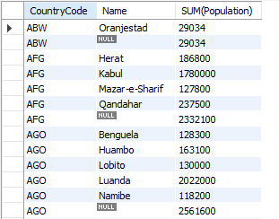
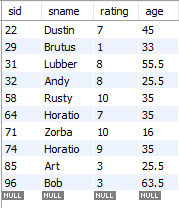
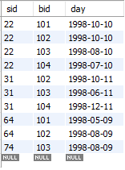
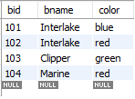

# SQL 한방에 끝내기


# 1. SQL의 분류

## DML

Data Manipulation Language

- 데이터 조작 언어
- `SELECT`, `INSERT`, `UPDATE`, `DELETE` (CRUD)

## DDL

Data Definition Language

- 데이터 정의 언어
- 테이블, 뷰, 인덱스 등의 database를 생성, 삭제, 변경
- `CREATE`, `DROP`, `ALTER`

## DCL

Data Control Language

- 데이터 제어 언어
- 권한 부여, 권한 제거
- `GRANT`, `REVOKE`

# SQL 명령어 연습1


### 기본 명령어

```sql
SHOW DATABASES;
USE world;
SHOW TABLES;          # world 테이블 이름 보기
SHOW TABLE STATUS;    # 데이터베이스 world의 테이블 정보 조회
DESCRIBE city;        # city 테이블에 무슨 열이 있는지 확인
DESC city;
DESC country;
DESC countrylanguage;
```

### SELECT, FROM, WHERE, AND, BETWEEN, >, ≤, ==, ≠

```sql
SELECT Name, Population 
From city;

SELECT Name, Population
FROM city
WHERE Population > 8000000;

SELECT *
FROM city
WHERE Population < 80000000
AND Population > 7000000;

SELECT *
FROM city
WHERE Population
BETWEEN 7000000 AND 8000000;

# 한국에 있는 도시들 보기
SELECT *
FROM city
WHERE CountryCode = 'KOR';

# 미국에 있는 도시들 보기
SELECT *
FROM city
WHERE CountryCode = 'USA';

# 한국에 있는 도시들 중에 인구 수가 1,000,000 이상인 도시 보기
SELECT *
FROM city
WHERE CountryCode = 'KOR'
AND Propulation >= 1000000;
```

### IN

- 이산적인 값의 조건에서 사용가능

```sql
SELECT *
FROM city
WHERE Name IN('Seoul', 'New York', 'Tokyo');

# 한국, 미국, 일본의 도시들만 보기
SELECT *
FROM city
WHERE CountryCode IN('KOR', 'USA', 'JPN');
```

### LIKE

- 문자열의 내용을 검색하기 위해 사용

```sql
# abcd_ :한 글자만 매치
SELECT *
FROM city
WHERE CountryCode LIKE 'KO_';  # KOR

# abcd% : 문자 뒤에 무엇이든 허용
SELECT *
FROM city
WHERE Name LIKE 'Tel %';   # Tel Aviv-Jaffa
```

### Sub Query

- 쿼리문 안에 또 쿼리문이 들어 있는 것
- 서브 쿼리의 결과가 둘 이상이 되면 에러 발생
- 여러개의 결과가 나올 때는 **ANY**, **SOME**, **ALL** 등 사용

```sql
SELECT *
FROM city
WHERE CountryCode = ( SELECT CountryCode
                      FROM city
                      WHERE Name = 'Seoul' );

# ANY : 서브쿼리의 여러 개의 결과중 하나만 만족해도 가능 (=ANY 와 IN 은 동일)
SELECT *
FROM city
WHERE Population > ANY ( SELECT Population
                         FROM city
                         WHERE District = 'New York' );

# ALL : 서브쿼리의 여러 개의 결과를 모두 만족해야함
SELECT *
FROM city
WHERE Population > ALL ( SELECT Population
                         FROM city
                         WHERE District = 'New York' );
```

### ORDER BY

```sql
# ASC : 오름차순 (default 임)
SELECT *
FROM city
ORDER BY Population ASC;

SELECT *
FROM city
ORDER BY Population;

# DESC : 내림차순
SELECT *
FROM city
ORDER BY CountryCode ASC, Population DESC;

# 인구수로 내림차순하여 한국에 있는 도시 보기
SELECT *
FROM city
WHERE CountryCode = 'KOR'
ORDER BY Population DESC;

# 국가 면적 크기로 내림차순하여 보기
SELECT *
FROM country
ORDER BY SurfaceArea DESC;
```

### DISTINCT

- 중복된 것은 1개씩만 출력

```sql
SELECT DISTINCT CountryCode
From city;
```

### LIMIT

- 출력 개수를 제한
- 상위의 N개만 출력하는 '**LIMIT N**' 구문

```sql
SELECT *
FROM city
ORDER BY Population DESC
LIMIT 10;
```

### **Aggregate operator**

- **Aggregate operator**는 중첩(nested)될 수 없다!!
- 종류

```sql
# 도시는 총 몇개인가?
SELECT COUNT(*)
FROM city;

# 도시들의 평균 인구수
SELECT AVG(Population)
FROM city;
```

### GROUP BY, AS(Alias)

- 그룹으로 묶어주는 역할
- **Aggregate Function** (집계 함수)을 함께 사용

```sql
# 같은 CountryCode 를 갖는 city 중 Population 이 가장 큰 놈만 출력
SELECT CountryCode, Max(Population)
FROM city
GROUP BY CountryCode;

SELECT CountryCode, AVG(Population) AS 'Average'
FROM city
GROUP BY CountryCode;

```

### HAVING

- **WHERE** 과 비슷한 개념으로 조건 제한
- **Aggregate Function** (집계 함수)에 대해 조건을 제한할 때 사용
- 반드시 **GROUP BY** 절 이후에 나와야함

```sql
SELECT CountryCode, MAX(Population)
FROM city
GROUP BY CountryCode
HAVING MAX(Population) > 8000000;
```

### ROLLUP

- 총합 or 중간합계가 필요한 경우
- **GROUP BY** 절과 함께 **WITH ROLLUP** 문 사용

```sql
SELECT CountryCode, Name, SUM(Population)
From city
GROUP BY CountryCode, Name WITH ROLLUP;
```

- 결과 모습

    

    **CountryCode** 끝날때 마다 `SUM(Population)` 의 값이 있음

### JOIN

- 여러 테이블에서 가져온 record 들을 조합 → 하나의 테이블

```sql
SELECT *
FROM city
JOIN country ON city.CountryCode = country.Code;

# city, country, countrylanguage 테이블 3개를 join 하기
SELECT *
FROM city
JOIN country ON city.CountryCode = country.Code
Join countrylanguage on city.CountryCode = countrylanguage.CountryCode;
```

# 3. SQL 명령어 연습2

### DB 데이터(Sailor, Reserve, Boat)

<p float="left" align="middle">
    
     
     
</p>


### 1. DATABASE, TABLE 생성

```sql
SHOW DATABASES;
CREATE DATABASE test_db;
USE test_db;

SHOW TABLES;
SHOW TABLE STATUS;

CREATE TABLE sailor(
	  sid int NOT null PRIMARY KEY,
	  sname varchar(10) NOT null,
    rating int NOT null,
    age real NOT null
);

CREATE TABLE boat(
	  bid int NOT null PRIMARY KEY,
	  bname varchar(10) NOT null,
	  color varchar(10) NOT null
);

CREATE TABLE reserve(
  	sid int NOT null,
    bid int NOT null,
    day date NOT null,
    CONSTRAINT PRIMARY KEY(sid, bid, day));
    
SHOW TABLES;
DESC TABLE sailor;
DESC TABLE boat;
DESC TABLE reserve;
```

### 2. TABLE 데이터 삽입

```sql
INSERT INTO Sailor (sid, sname, rating, age)
VALUE 	(22, 'Dustin', 7, 45),
  		(29, 'Brutus', 1, 33),
	    (31, 'Lubber', 8, 55.5),
        (32, 'Andy', 8, 25.5),
        (58, 'Rusty', 10, 35.0),
        (64, 'Horatio', 7, 35.0),
        (71, 'Zorba', 10, 16),
        (74, 'Horatio', 9, 35),
        (85, 'Art', 3, 25.5),
        (96, 'Bob', 3, 63.5);

INSERT INTO Reserve (sid, bid, day)
VALUE 	(22, 101, '1998-10-10'),
	    (22, 102, '1998-10-10'),
        (22, 103, '1998-08-10'),
        (22, 104, '1998-07-10'),
        (31, 102, '1998-10-11'),
        (31, 103, '1998-06-11'),
        (31, 104, '1998-12-11'),
        (64, 101, '1998-05-09'),
        (64, 102, '1998-08-09'),
        (74, 103, '1998-08-09');
        
INSERT INTO Boat (bid, bname, color)
VALUE	(101, 'Interlake', 'blue'),
		(102, 'Interlake', 'red'),
        (103, 'Clipper', 'green'),
        (104, 'Marine', 'red');

UPDATE sailor SET sname = 'Dustin' WHERE sid = 22;
DELETE sailor FROM sailor WHERE sid = 22;

SELECT * FROM Sailor;
SELECT * FROM Reserve;
SELECT * FROM Boat;

SELECT COUNT(*) FROM sailor;
```

### 3. 기본 질의문

```sql
# Q3.Lubber에 의해 예약된 배의 색을 구하시오
SELECT  B.color
FROM    Boat B, Reserve R, Sailor S
WHERE   B.bid = R.bid AND R.sid = S.sid AND S.sname = 'Lubber';

# Q17.한날에 서로 다른 두 배를 운행한 사람의 등급에 대한 증가치를 계산하시오.
SELECT	S.sname, S.rating + 1 AS rating
FROM    Reserve R1, Reserve R2, Sailor S
WHERE   R1.day = R2.day AND R1.sid = S.sid
        AND R2.sid = S.sid AND R1.bid != R2.bid;

#
SELECT  S1.sname AS name1, S2.sname AS name2
FROM    Sailor S1, Sailor S2
WHERE   2*S1.rating = S2.rating-1;

# Q18.이름이 B로 시작해서 B로 끝나고 세 자 이상인 뱃사람의 나이를 구하시오.
SELECT  S.age
FROM    Sailor S
WHERE   S.sname LIKE 'B_%B';
```

### 4. UNION, INTERSECT, EXCEPT

- 중복제거가 default
- 중복을 유지하려면 **UNION ALL**, **INTERSECT ALL**, **EXCEPT ALL**
- **INTERSECT**, **EXCEPT** - MySQL은 지원 안함 (대신 **JOIN** 연산 사용)

```sql
# Q5.적색 혹은 녹색 배를 예약한 적이 있는 뱃사람의 이름을 구하시오.
SELECT  S.sname
FROM    Sailor S, Reserve R, Boat B
WHERE   (B.color = 'red' or B.color = 'green') AND
        B.bid = R.bid AND R.sid = S.sid;

SELECT  S.sname
FROM    Sailor S, Reserve R, Boat B
WHERE   S.sid = R.sid AND R.bid = B.bid AND B.color = 'Red'
UNION
SELECT  S2.sname
FROM    Sailor S2, Reserve R2, Boat B2
WHERE   S2.sid = R2.sid AND R2.bid = B2.bid AND B2.color = 'Green';

# Q6.적색과 녹색 배를 둘 다 예약한 적이 있는 뱃사람의 이름을 구하시오.
SELECT  S.sname
FROM    Boat B1, Boat B2, Reserve R1, Reserve R2, Sailor S
WHERE   B1.color = 'red' AND B1.bid = R1.bid
        AND B2.color = 'green' AND B2.bid = R2.bid
        AND R1.sid = R2.sid
        AND R2.sid = S.sid;

SELECT  S.sname
FROM     Sailor S, Reserve R, Boat B
WHERE   S.sid = R.sid AND R.bid = B.bid AND B.color = 'Red'
INTERSECT
SELECT  S2.sname
FROM    Sailor S2, Reserve R2, Boat B2
WHERE   S2.sid = R2.sid AND R2.bid = B2.bid AND B2.color = 'Green'

SELECT	S.sname
FROM	Sailor S, Reserve R, Boat B
WHERE	S.sid = R.sid AND R.bid = B.bid AND B.color = 'red'
		AND S.sid IN ( SELECT 	S2.sid
					   FROM		Sailor S2, Reserve R2, Boat B2
                       WHERE	S2.sid = R2.sid AND R2.bid = B2.bid AND B2.color = 'green');

# Q19.적색은 예약했지만 녹색 배는 예약하지 않은 모든 뱃사람 번호를 구하시오.
SELECT  R.sid
FROM    Reserve R, Boat B
WHERE   R.bid = B.bid AND B.color = 'red'
EXCEPT
SELECT  R2.sid
FROM    Reserve R2, Boat B2
WHERE   R2.bid = B2.bid AND B2.color = 'green';

# Q20.등급 10을 가지거나 104 배를 예약한 모든 뱃사람의 sid를 구하시오.
SELECT  S.sid
FROM    Sailor S
WHERE   S.rating = 10
UNION
SELECT  R.sid
FROM    Reserve R
WHERE   R.bid = 104;
```

### Nested Query(중첩 질의)

- 집합 비교 연산자

```sql
IN, EXIST**S**, UNIQUE, NOT IN, NOT EXISTS, op ANY, op ALL
```

```sql
# Q1.배 번호 103을 예약한 적이 있는 뱃사람의 이름을 구하시오.
SELECT  S.sname
FROM    Sailor S, Reserve R
WHERE   S.sid = R.sid AND R.bid = 103;

SELECT  S.sname
FROM    Sailor S
WHERE   S.sid IN (SELECT  R.sid
                  FROM    Reserve R
                  WHERE   R.bid = 103);

# IN 과 =ANY 는 동일 / NOT IN 과 <>ALL 은 동일
SELECT  S.sname
FROM    Sailor S
WHERE   S.sid = ANY (SELECT R.sid
                     FROM    Reserve R
                     WHERE   R.bid = 103);

SELECT  S.sname
FROM    Sailor S
WHERE   EXISTS (SELECT  *
                FROM    Reserve R
                WHERE   R.bid = 103 AND R.sid = S.sid);

# Q2.적색 배를 예약한 적이 있는 뱃사람의 이름을 구하시오
SELECT  S.sname
FROM    Sailor S
WHERE   S.sid IN (SELECT    R.sid
                  FROM      Reserve R
                  WHERE     R.bid   IN (SELECT  B.bid
                                        FROM    Boat B
                                        WHERE   B.color='red'));

# Q21.적색 배를 예약한 적이 없는 뱃사람의 이름을 구하시오
SELECT  S.sname
FROM    Sailor S
WHERE   S.sid   NOT IN (SELECT  R.sid
                        FROM    Reserve R
                        WHERE   R.bid IN (SELECT B.bid
                                          FROM   Boat B
                                          WHERE  B.color = 'red'));
```

### reference

[이수안컴퓨터연구소 유튜브](https://www.youtube.com/watch?v=vgIc4ctNFbc)

데이터베이스 시스템 3판_Raghu Ramakrishnan