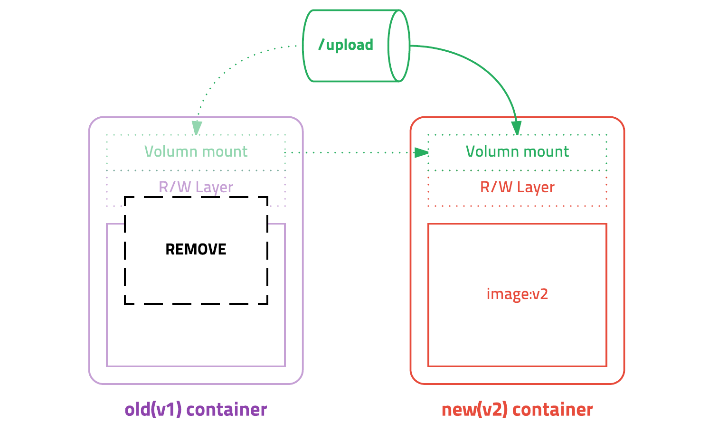
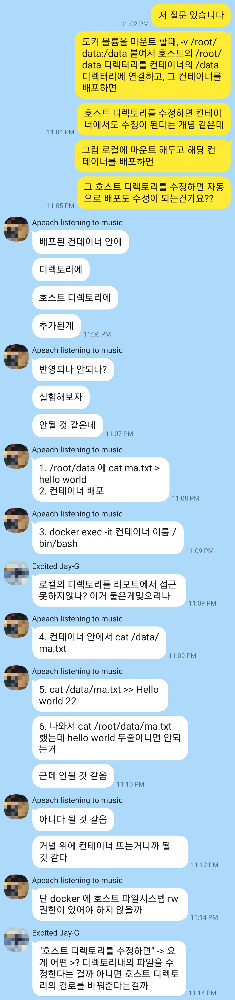

# Concept-of-a-docker
- 2020-11-23

학교에서 DB 시간에 Docker를 사용하는데 마침 또 CEOS (신촌기반 IT창업 동아리) 에서 백엔드 배포를 docker를 활용해보고자 한다. 이 기회에 Docker 공부를 제대로 해두어 남겨 두고자 한다.

## 도커를 사용하는 이유

- 개발환경의 쉬운 셋팅 (압도적인듯...)
- 가상화 환경 사용 X
    - 기존 : CPU등의 resource를 사용하여 새로운 컴퓨터를 만드는 것 - 용량 크다, 느리다
    - docker : 리눅스의 container 기술을 이용하여 가상화를 하지 않고, 기존의 운영체제 안에서 process만 독립시켜 사용. - os를 띄우지 않으므로 기존의 시스템 자원 공유
- real machine 과 docker 간의 성능차이가 거의 없다.

## 윈도우 기준 사용

- wsl2 사용

## 도커의 개념

- 운영체제를 설치 하는 것이 아닌, 패키지 관리가 설치(apt-get 등)된 **image**를 가져 온다.
- docker : docker hub = git : github  와 비슷한 개념 (pull, push 등)
- **Image** : 실행파일 + 라이브러리 (일종의 file)
- **Container** : image를 실행한 상태 (일종의 process)
    - container에서 실행할 메인 실행파일이 실행된 상태여야 container가 유지가 된다.
    - 종료되면 container도 같이 종료 된다.
- container 안과 밖은 완전히 독립되어 서로 무엇이 깔려있든 사용할 수 없다.
- 내가 만든 container를 image화 시켜 편하게 이용 가능

## Container 업데이트



`-v` 옵션을 사용해 docker run할 때 이미지만 변경하고 같은 볼륨을 마운트 하는 식으로 사용한다.

## Docker 명령어

### sudo 빼버리기!

```bash
# docker 명령어는 root권한으로 sudo를 붙여 실행해야 하지만 아래 명령어를 통해 권한 부여

sudo usermod -aG docker $USER # 현재 접속중인 사용자에게 권한주기
sudo usermod -aG docker your-user # your-user 사용자에게 권한주기
```

### 이미지 관련 명령어

```bash
# 이미지 확인하기
docker images [OPTIONS] [REPOSITORY[:TAG]]
docker images

# 이미지 다운로드 하기(pull)
docker pull [옵션] [이미지 이름]:[태그]
docker pull ubuntu:20.04

# 이미지 삭제하기(rmi)
docker rmi [OPTIONS] IMAGE [IMAGE...]
docker rmi ${UBUNTU_IMAGE_ID}
```

### 컨테이너 기본 명령어

```bash
# 실행중인 container 목록 확인
docker ps [options]
docker ps

# 모든 container 목록 확인
docker ps -a
```

### 컨테이너 실행 관련 명령어

```bash
# 이미지를 **컨테이너로 생성**한 뒤 [실행할 파일]을 실행
docker run [옵션] [이미지 이름]:[tag] [실행할 파일]

docker run -it ubuntu:20.04 /bin/bash   # ubuntu:20.04 컨테이너 안을 bash를 통해서 접속
docker run --name mariadb \
	-d -p 3306:3306 \
	-e MYSQL_ROOT_PASSWORD=mariadb \
	mariadb

#  호스트의 /my/own/datadir 디렉토리를 컨테이너의 /var/lib/mysql 디렉토리로 **마운트**
docker run --name mariadb \
	-d -p 3306:3306 \
	-e MYSQL_ROOT_PASSWORD=mariadb \
	-v /my/own/datadir:/var/lib/mysql/ \ # <- volexiume mount
	mariadb

# 컨테이너를 실행시키지만 컨테이너 안으로 들어가지는 않는다.
docker start [옵션] [컨테이너 이름 or ID]
docker restart [컨테이너 이름]

docker start mariadb          # mariadb 라는 CONTAINER NAMES로 start (아래와 동일)
docker start 441688e698a3     # 441688e698a3 라는 CONTAINER ID로 start (위와 동일)

# 실행된 컨테이너 안으로 들어가기
docker attach [옵션] [컨테이너 이름]

docker attach mariadb
docker attach -it mariadb /bin/bash

# 메인 실행파일 이외에 실행중인 컨테이너 안의 다른 실행파일을 실행할 수 있도록 하는 명령
docker exec [옵션] [container 이름] [명령] [매개 변수]

docker exec -it mariadb /bin/bash

# bash shell 에서 container 종료, 빠져나오기 / 종료하지 않고 빠져나오기
$ exit     # 종료
$ (ctrl + D)    # 종료 단축키
$ (ctrl + PQ)   # container를 종료하지 않고 빠져나오기
```

- 명령어 분석
    - docker run -it ubuntu:20.04 /bin/bash
        - -it 로 가장 자주 사용할 옵션
            - -i (interactive) : 사용자가 입출력 가능한 상태 옵션
            - -t (Pseudo-tty) : 가상 터미널 환경을 emulation 옵션
        - /bin/bash : ubuntu 컨테이너 안의 실행파일
- 옵션
    - -d 옵션 컨테이너를 백그라운드로 실행
    - -p 3306:3306 옵션: 호스트의 3306번 포트와 컨테이너의 3306번 포트를 연결, 외부에 노출
    - -v /my/own/datadir:/var/lib/mysql : 호스트의 /my/own/datadir 디렉터리를 컨테이너의 /var/lib/mysql 디렉터리에 연결.  
    /my/own/datadir 디렉터리에 파일을 넣으면 컨테이너에서 해당 파일을 읽을 수 있습니다.

### 컨테이너 중지, 삭제, 로그 명령어

```bash
# Container 중지하기 (stop)
docker stop [OPTIONS] CONTAINER [CONTAINER...]
docker stop ${UBUNTU_CONTAINER_ID}

# Container 제거하기 (rm)
docker rm [OPTIONS] CONTAINER [CONTAINER...]
docker rm ${UBUNTU_CONTAINER_ID} ${MARIA_CONTAINER_ID}

# 중지된 모든 container 삭제
docker rm -v $(docker ps -a)

# container 로그 보기 (log)
docker logs [OPTIONS] CONTAINER

docker logs ${MARIADB_CONTAINER_ID} # 로그 확인하기
docker logs --tail 10 ${MARIADB_CONTAINER_ID} # 10줄만 확인하기
docker logs -f ${MARIADB_CONTAINER_ID} # 실시간으로 생성되는 로그 확인하기
```

#### 참고 자료

[가장 빨리 만나는 Docker]([http://pyrasis.com/private/2014/11/30/publish-docker-for-the-really-impatient-book](http://pyrasis.com/private/2014/11/30/publish-docker-for-the-really-impatient-book))

[생활코딩]([https://opentutorials.org/course/128/8657](https://opentutorials.org/course/128/8657))

[도커 공식 문서 - 명령어]([https://docs.docker.com/engine/reference/commandline/docker/](https://docs.docker.com/engine/reference/commandline/docker/)) 

ps. -v 옵션을 보고 문득 혼자 상상의 나래를 펼치며 망상을 했었다... 이를 여기저기 물어보다 깨닫게 된다. 게다가 물어보면 정말 검증 방법까지 알려주시는 감사한 현업자 선배님들...

<p float="left" align="middle">
    
     
</p>