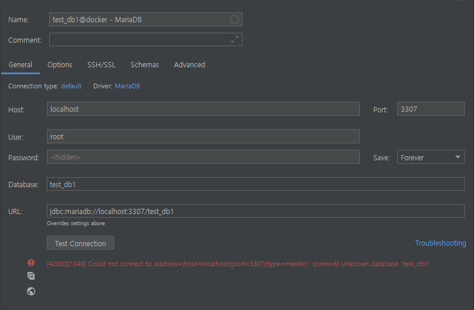
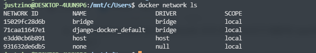
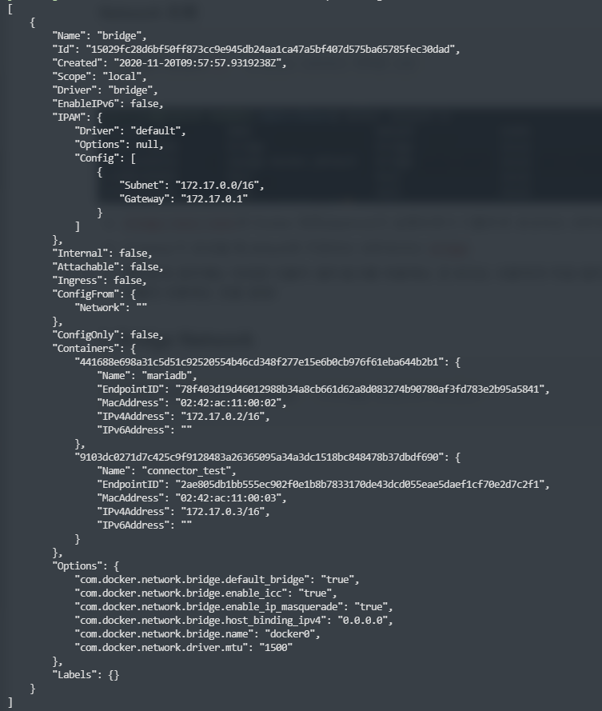

# Docker-Nework-connection

-2020-11-24

# 내가 했던 생각

- window - WSL2 - mariadb container 띄웠으니 window의 intellij에서 해당 mariadb 로 연동해야지~
- general에서 디비 열은 포트랑 db user에 root로 넣고 설정한 비번 넣고 연결!



- 어림 없지, connection error나 먹어라!!!
- port binding도 3307:3307 맞는데... ps 해보면 컨테이너도 잘 떠있고...
- 아! 혹시 디비 유저 권한이라든지가 문제가 되나?? 어차피 root로 접속이라 상관없는 거 아닌가?
- `docker exec it /bin/bash` → mysql 콘솔 접속 → `use mysql;` → `select Host User from user;` 해보니 `root localhost` 로 잡혀있음
- 도커 컨테이너 입장에서 localhost는 도커 컨테이너이기 때문에, bash로 들어갔을 때만 접근이 가능?!!
- 즉, 도커 컨테이너 외부에서 접속하는건 도커 컨테이너 입장에서 localhost가 아니다!!!

---

# Docker network

위와 같은 깨달음과 여러가지 의문을 갖고 있을 때 DB시간에 조교님이 단비처럼 Docker network 설명해주셨다. (듣다가 중간에 머리에서 buffer overflow 터진 것 같지만..)

- 각 컨테이너는 하나의 네트워크로 묶여있어야 컨테이너 끼리 연결 가능하다.
- Docker에서 지원하는 방식은 4가지 (Bridge, Host, Container, none)

### Network 조회

```bash
ipconfig                              # 윈도우 ip 주소 조회
ifconfig                              # 리눅스 ip 주소 조회 
ip addr show
docker network ls                     # Docker 네트워크 목록을 조회
docker exec [컨테이너] ip addr show    # 해당 컨테이너의 ip 주소들 조회
```



- `bridge, host, none`은 Docker 데몬(daemon)이 실행되면서 디폴트로 생성되는 네트워크
- container가 생성될 때 default로 지정되는 네트워크는 `bridge`
- **대부분의 경우에는 이러한 디폴트 네트워크를 이용하는 것 보다는 사용자가 직접 네트워크를 생성해서 사용하는 것을 권장!**

여기서 잠깐 네트워크 지식
- 대역이 다른 subnet 끼리는 통신을 위해 routing이 필요하다.
- 서로 대역이 다른지는 subnet mask와의 AND 연산을 통해 알 수 있다.
- 같은 subnet 대역 안에서는 host 끼리 서로 통신이 가능하다.
- 즉 네트워크가 나눠져 있는 host끼리 연결하려고 하는 것이 문제!!

## 현재 연결 - Bridge Network

```bash
docker network inspect bridge    # bridge network의 상세정보
```



- bridge의 `Subnet`이 172.17.0.0/16 이고, Gateway가 172.17.0.1 이다.
- Containers 에서 mariadb의 IPv4 : 172.17.0.2/16, connector_test의 IPv4 : 172.17.0.3/16 이므로 두 컨테이너는 동일한 bridge에 속해 있음을 알 수 있다.
- 동일한 bridge에 속해있으므로 하나의 네트워크로 묶여있고, 이런 경우 서로 IP로 연결이 가능하다.
- 두 container가 같은 bridge에 속해 있는 것은 gradle을 사용해 미리 연결을 해두었기 때문.

---

# Container 네트워크 연결 방법

## 1. Bridge  Network

1. 네트워크 생성

    ```bash
    docker network create connector-net    # 새로운 docker network 생성 (default: bridge)
    docker network ls                      # 추가된 네트워크 확인해보기 
    docker network instpect connector-net  # 아직 아무 컨테이너도 연결되지 않았음을 확인
    ```

2. 각 컨테이너를 연결

    ```bash
    # mariadb 컨테이너를 connector-net 네트워크에 연결
      docker network connect connector-net mariadb
    # connector_test 컨테이너를 connector-net 네트워크에 연결
      docker network connect connector-net connector_test
    # connector-net 네트워크에 container들이 연결되었음을 확인
      docker network instpect connector-net
    ```

3. 네트워크 연결 해제

    ```bash
    # mariadb 컨테이너를 bridge(이름) 네트워크로부터 연결 해제
      docker network disconnect bridge mariadb
    # connector_test 컨테이너를 bridge(이름) 네트워크로부터 연결 해제
      docker network disconnect bridge connector_test
    # bridge 네트워크에 container들의 연결이 끊어진 것을 확인
      docker network instpect bridge 
    ```

4. 네트워크 제거

    **주의사항**
    1. 네트워크를 제거하기 전에는 **반드시 컨테이너를 다른 네트워크에 붙여놓고**, 제거 해야 한다.
    2. 삭제하고자 하는 네트워크에 연결되어 실행중인 컨테이너가 있다면, 실행 중인 모든 컨테이너를 먼저 중지시키고, 네트워크를 삭제해야 한다.

    ```bash
    # bridge 네트워크 제거
      docker network rm bridge
    ```

## 2. Host

1. host의 네트워크로 연결

    ```bash
    # connecetor_test **이미지**를 host network에서 maraidb_connector:0.1 **컨테이너**로 생성
    docker run -itd \
    --name connecetor_test \
    --net=host \
    -v /mnt/d/connector:/usr/src/connector \
    maraidb_connector:0.1

    #  mariadb **이미지**를 host network에서 maraidb **컨테이너**로 생성
    docker run -- name mariadb \
    -d -p 3306:3306 \
    -e MYSQL_ROOT_PASSWORD=mariadb \
    -v /mnt/d/mysql:/var/lib/mysql/ \
    --net=host \
    maraidb

    docker exec connector_test ip addr show
    ```

    - container 를 생성할 때 `--net=host` 옵션을 주어, host의 네트워크를 그대로 사용할 수 있다.
    - -p 옵션은 host 옵션을 사용하게 되면, 포트포워딩을 할 필요가 없어지므로, 자동으로 무시
- IP 정보에 `localhost`를 입력해도, 연결이 잘 된다.

## 3. Container

1. 기존에 존재하는 다른 컨테이너의 network환경을 공유

    ```bash
    # connecetor_test **이미지**를 다른 컨테이너 network에서 maraidb_connector:0.1 **컨테이너**로 생성
    docker run -itd \
    --name connecetor_test \
    --net=container:[공유하고자하는 container id] \
    -v /mnt/d/connector:/usr/src/connector \
    maraidb_connector:0.1
    ```

- IP 정보에 `localhost`를 입력해도, 연결이 잘 된다.

## 4. None

- `--net=none` 옵션 사용
- 이건 솔직히 몰라도 된다
- 폐쇄망 / loopback 인터페이스만 있고, 통신을 위한 eth0 인터페이스는 없음
